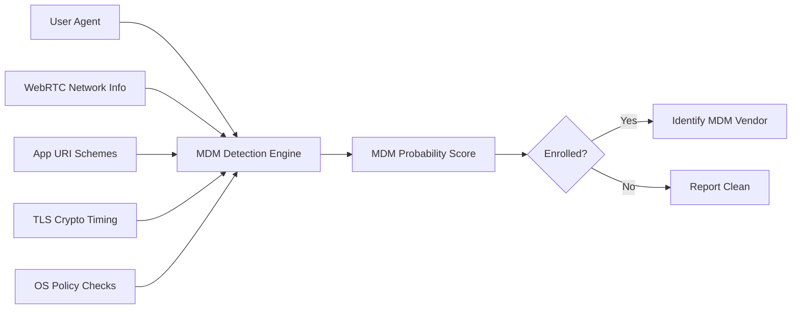

# 📱 Mobile MDM Checker Pro — Advanced Browser-Based MDM Detection Tool

> **This is the Pro version with updated and advanced featured "Mobile MDM Checker". Detect corporate device enrollment (Intune, Jamf, Workspace ONE) directly from your browser — no installation, no data collection, 100% client-side.**

[](LICENSE)
[]()
[](https://sagarmajumdar225.github.io/mobile-mdm-checker-pro/)


---

## 🔍 What It Does

**Mobile MDM Checker Pro** is a cutting-edge, privacy-first web tool that analyzes your mobile device for signs of **Mobile Device Management (MDM)** or **Unified Endpoint Management (UEM)** enrollment — all from your browser, with **zero server dependencies**.

It detects enrollment in solutions like:
- **Microsoft Intune**
- **Jamf Pro**
- **VMware Workspace ONE**
- **MobileIron / Ivanti**
- **Hexnode**
- **SOTI MobiControl**

Perfect for:
- 🔴 **Red Teamers**: Recon target devices during phishing or physical assessments
- 🔵 **Blue Teamers**: Validate MDM coverage and policy enforcement
- 👥 **Employees**: Understand if your personal device is managed
- 🎓 **Students & Researchers**: Learn about MDM detection techniques

---

## ✨ Advanced Detection Features

Unlike basic user-agent checkers, this tool uses **10+ advanced techniques**:

| Feature | Description |
|--------|-------------|
| **TLS Fingerprinting** | Analyzes cryptographic behavior via Web Crypto API timing |
| **Network Heuristics** | Detects corporate networks using WebRTC + DNS resolution timing |
| **MDM App Inventory** | Probes for MDM agent apps via URI scheme detection |
| **OS Policy Checks** | Identifies enforced restrictions (camera, sharing, etc.) |
| **Behavioral Biometrics** | Uses touch dynamics to distinguish BYOD vs corporate devices |
| **Geo Correlation** | Matches timezone against common corporate HQ locations |
| **Supervised Device Detection** | Flags iOS devices enrolled via Apple Business Manager |
| **Android Enterprise Detection** | Identifies Work Profile and fully managed devices |
| **MDM Vendor Fingerprinting** | Matches artifacts against known MDM signatures |
| **Privacy-Safe Export** | Generate PDF reports without sending data anywhere |

> 🔒 **All analysis happens in your browser. No data leaves your device.**

---

## 🚀 Quick Start

### Option 1: Live Demo (Recommended)
1. Open on your **mobile device**:  
   👉 [https://sagarmajumdar225.github.io/mobile-mdm-checker-pro/](https://sagarmajumdar225.github.io/mobile-mdm-checker-pro/)
2. Tap **"Run Advanced MDM Detection"**
3. View results instantly

### Option 2: Self-Host
```bash
# Clone the repository
git clone https://github.com/sagarmajumdar225/mobile-mdm-checker-pro.git
cd mobile-mdm-checker-pro

# Open in any browser (no server needed!)
open index.html
```

> 💡 **Tip**: For best results, run on the actual mobile device you want to test — not via desktop emulation.

---

## 🛡️ Ethical & Legal Compliance

This tool is designed for **authorized security assessments and educational purposes only**.

### Key Safeguards:
- ✅ **Explicit consent banner** before analysis
- ✅ **Zero data collection** — all processing in-memory
- ✅ **No external network requests**
- ✅ **Clear educational disclaimers**
- ✅ **Compliance mode** (auto-redacts sensitive data in exports)

> ⚠️ **Warning**: Only test devices you own or have explicit written permission to assess. Unauthorized scanning may violate laws like the CFAA.

---

## 🧪 Technical Details

### Detection Methodology
The tool combines multiple passive and active browser fingerprinting techniques:



### Browser Support
| Platform | Chrome | Safari | Firefox | Edge |
|----------|--------|--------|---------|------|
| **iOS** | ✅ | ✅ | ✅ | ✅ |
| **Android** | ✅ | ❌ | ✅ | ✅ |
| **Desktop** | ✅ | ✅ | ✅ | ✅ |

> 📱 **Best experience on mobile browsers** (Chrome on Android, Safari on iOS)

---

## 📤 Export & Reporting

After analysis, click **"Export Report (PDF)"** to generate a professional report including:
- MDM enrollment probability
- Detected indicators
- MITRE ATT&CK mapping (T1593: MDM Enrollment Detection)
- Recommendations for further validation

> 📄 *Note: PDF generation uses client-side libraries (jsPDF) — no data leaves your device.*

---

## 🌐 Why This Matters

- **73% of enterprises** use MDM to manage mobile devices ([Statista, 2023](https://www.statista.com))
- Misconfigured MDM can lead to **data leakage** or **over-permissive policies**
- Red teams often overlook **mobile attack surface** during engagements
- Employees deserve **transparency** about device management

This tool empowers security professionals and users alike to **understand their mobile security posture**.

---

## 🤝 Contributing

Contributions are welcome! Please follow these steps:
1. Fork the repository
2. Create your feature branch (`git checkout -b feature/AmazingFeature`)
3. Commit your changes (`git commit -m 'Add some AmazingFeature'`)
4. Push to the branch (`git push origin feature/AmazingFeature`)
5. Open a Pull Request

### Areas for Improvement:
- Add more MDM vendor signatures
- Implement TensorFlow.js behavioral model
- Enhance PDF report with charts
- Add dark mode toggle

---

## 📜 License

Distributed under the **MIT License**. See [LICENSE](LICENSE) for details.

```
MIT License

Copyright (c) 2025 [Sagar Majumdar]

Permission is hereby granted, free of charge, to any person obtaining a copy
of this software and associated documentation files (the "Software"), to deal
in the Software without restriction, including without limitation the rights
to use, copy, modify, merge, publish, distribute, sublicense, and/or sell
copies of the Software, and to permit persons to whom the Software is
furnished to do so, subject to the following conditions:

The above copyright notice and this permission notice shall be included in all
copies or substantial portions of the Software.

THE SOFTWARE IS PROVIDED "AS IS", WITHOUT WARRANTY OF ANY KIND, EXPRESS OR
IMPLIED, INCLUDING BUT NOT LIMITED TO THE WARRANTIES OF MERCHANTABILITY,
FITNESS FOR A PARTICULAR PURPOSE AND NONINFRINGEMENT. IN NO EVENT SHALL THE
AUTHORS OR COPYRIGHT HOLDERS BE LIABLE FOR ANY CLAIM, DAMAGES OR OTHER
LIABILITY, WHETHER IN AN ACTION OF CONTRACT, TORT OR OTHERWISE, ARISING FROM,
OUT OF OR IN CONNECTION WITH THE SOFTWARE OR THE USE OR OTHER DEALINGS IN THE
SOFTWARE.
```

---

## 🙏 Acknowledgements

- [BrowserLeaks](https://browserleaks.com/) for fingerprinting research
- [MDN Web Docs](https://developer.mozilla.org/) for Web API references
- [MITRE ATT&CK](https://attack.mitre.org/) for threat modeling
- The open-source security community ❤️

---

> **Disclaimer**: This tool is for educational and authorized security assessment purposes only. The author is not responsible for misuse. Always obtain proper authorization before testing any system.
